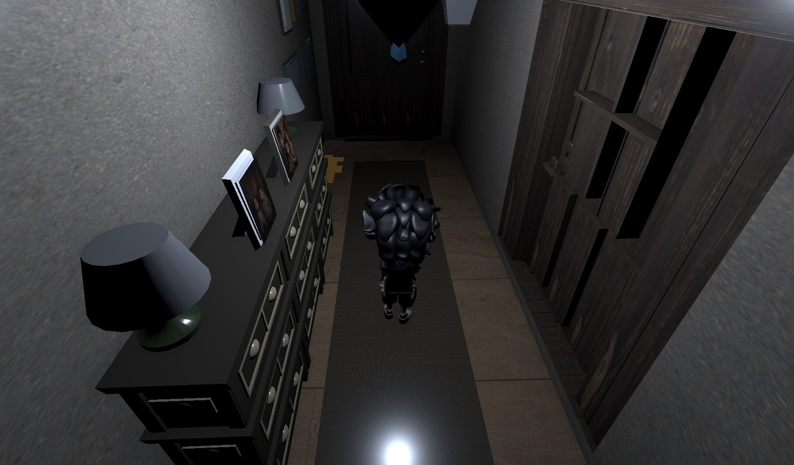
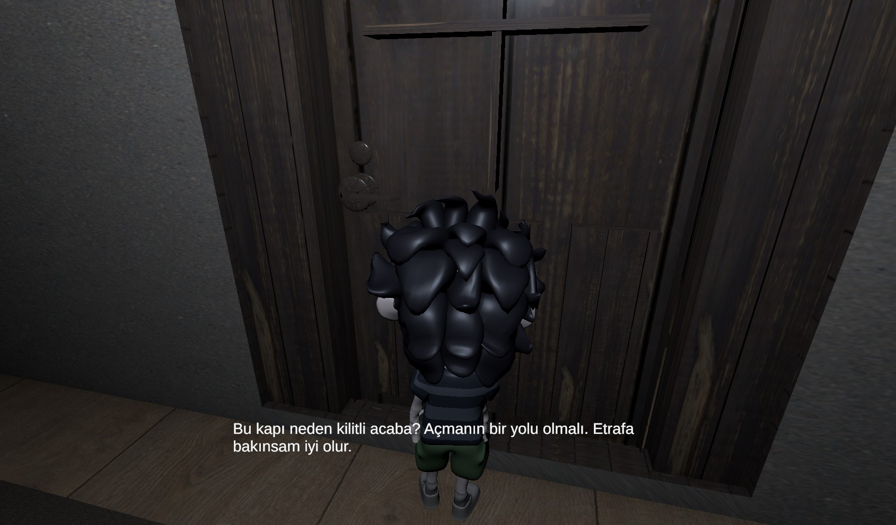
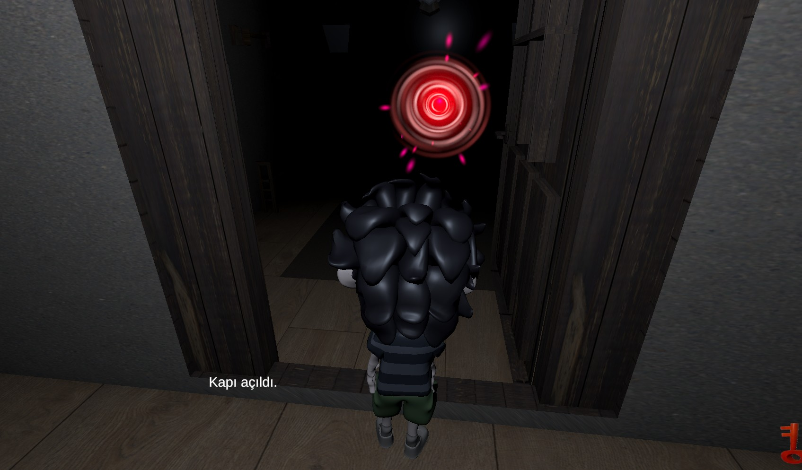

## Final Gameplay Showcase

This repository presents a gameplay interaction showcase from a group game project currently in development.

The screenshots demonstrate:

* environment exploration
* locked door interaction
* key-based progression
* door opening mechanic
* puzzle-related gameplay flow

My contribution focuses on gameplay programming, script implementation and interaction mechanics.

## Screenshots

## Gameplay Video

The gameplay showcase video is shared on YouTube Shorts:

[https://youtube.com/shorts/BURAYA_YENI_VIDEO_LINKI](https://www.youtube.com/shorts/asu1CIL-R78)
